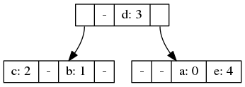
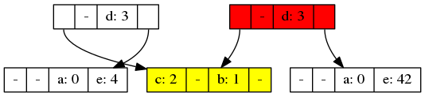

# Kelvin

A merkle-tree toolkit and backend.

# Merkle trees and Blockchains

Merkle trees enable developers to apply cryptographic hash functions to bulky representations of state in a very efficient manner. Because of this important feature, Merkle trees are widely used across a variety of decentralized applications, where the orchestration of independent entities can be properly achieved only when network nodes can be certain of the exact state of the whole system. 
In the context of blockchain-based infrastructures, examples of large state representations are, among the others, unspent transaction outputs, chain history, account state and smart contract storage.

When writing programs dealing with Merkle trees, the current practice is to settle for one underlying datastructure (e.g. a popular choice for smart contract platorms being the [Patricia or Radix tree](https://en.wikipedia.org/wiki/Radix_tree)).

Most implementations make use of key-value database backends (RocksDB, LevelDB), which are optimized for the storage of mutable data (i.e. data that may be updated or deleted) and, therefore, carry a non-negligible overhead in order to allow tracking of cache invalidation and efficient updates. This extra-logic is simply an unnecessary complication on the blockchain usecase, which nature is that of an append-only storage of immutable data. 

An additional problem is the tight coupling of most of these tree implementations with the database backends. This practice presents the disadvantages of making such implementations inflexible and reliant on specific database logic for rollbacks and transactions. As a consequence, changing and/or implementing alternative datastructures inevitably lead to complexity and duplication of efforts and code, since each new tree structure needs its own database integration layer. Ideally, in the case of a failed transaction, you should be able to just throw away the failed state and continue from the state before, with very low overhead.

In order to solve these problems, and to allow faster data structure modeling and iteration, we introduce Kelvin!

# Motivation

Kelvin is a library designed to combine the advantages of immutable data structures, on-disk persistence, and content-addressed trees (aka Merkle trees).

At DUSK Network Kelvin has been an indispensable tool for modeling truly blockchain-optimized data structures which pervade many of the core networks components requiring state representation, from transaction model up to the smart contract engine. Kelvin allowed us to avoid the hard work of implementing the storage and copy-on-write logic separately for each iteration. 

The data structure logic is separated from the plumbing of the database backend, the hash functions used and even the metadata annotations. And each can be optimized and tweaked separately.

Let's first get some background on these three topics, and later cover how they fit together.

## Immutable data structures

Let's say we have this map
```
{ a: 0, b: 1, c: 2, d: 3, e: 4 }
```

This could be represented in an immutable data structure like this:



Now, say we set `e` in the map to 42, the resulting immutable structure could look like this:



The leftmost node of the tree is actually our old map, it has not changed! The rightmost root colored red is the new map after changing e. As you can see, both maps share structure in both pointing to the yellow node containing b and c which did not change.

This is how you can efficiently keep copies around of the old map, you only pay the storage and update costs for the part of the tree that actually change.

### Clojure VS Rust

Clojure played a big role in popularizing the concept of immutable data structures, and all Clojure collections (maps/lists/sets) are immutable by default. While actually being performant enough in most common cases, there's also language support for so-called [transient](https://clojure.org/reference/transients) data structures. The argument being that as long as no other threads can see the structure while it's being modified, more efficient non-copying methods can be used. If you're familiar with Rust, this might ring a bell.

In Rust, every data structure being modified is already transient, based on the guarantees of &mut references. This means, we get the best of both worlds!

## On-disk persistance

The most common ways of saving state in a program is either through the filesystem, usually for logs and configuration files, or a database of some kind.

But wouldn't it be nice if we took our fancy trees, and just saved them to disk as-is? If your programs state can be represented as a collection of maps and sets, why could we not just write them to disk in the format that they are already in?

Let's look again at the previous example, why could we not have the children of the root node point to some kind of on-disk representation? And be loaded and cached on-demand? This is exactly how kelvin works.

```rust
let mut state = ProgramState::new();

state.do_things_that_modify_state();

// Let's set up a store
let dir = tempdir().unwrap();
let store = Store::<Blake2b>::new(&dir.path());

// A snapshot is a hash and a reference to a Store
let snapshot = store.persist(&mut state).unwrap();

let mut restored = store.restore(&snapshot).unwrap();
// restored can now be used as a normal `ProgramState`

```

`ProgramState` itself can be any composite of different maps, more on this later.

## Content-adressability

Content-addressing is a name for using cryptographic hashes to refer to byte streams. In this case, the serialized representation of our ProgramState. This means, that the "key" you use to look up the data, is a representation of that data itself. This has multiple benefits.

For one, you get integrity checking for free, if you look up data that has been altered or corrupted, by it's cryptographic hash, you will notice immediately. You also get deduplication. If, for example, your state contains multiple equivalent maps, as in the case of the shared subtree in the example above, it will only be stored once on disk.

### Merkle trees

A Merkle tree is exactly this, the root node is just the hash of the hashes of its leaves and/or subtrees. And as usual with Merkle Trees, structures maintained by kelvin also lend themselves to the construction of [Merkle Proofs](https://medium.com/crypto-0-nite/merkle-proofs-explained-6dd429623dc5)

# Bottom-up view

So, how is this implemented, and what do you need to adapt your program state to use this library?

## Content trait

The main trait underlying this library is the `Content` trait. It simply defines how a specific type is converted to/from bytes.

We are not using `serde`, since we want to impose additional restrictions on the types, such as being `Clone`:able, `Eq`, etc. And we also want to make sure the mapping to hash values is always 1-1.

```rust
/// The main trait for content-adressable types, MUST assure a 1-1 mapping between
/// values of the type and hash digests.
pub trait Content<H: ByteHash>
where
    Self: Sized + Clone + 'static + PartialEq + Eq,
{
    /// Write the type to a `Sink`
    fn persist(&mut self, sink: &mut Sink<H>) -> io::Result<()>;
    /// Restore the type from a `Source`
    fn restore(source: &mut Source<H>) -> io::Result<Self>;
}
```

And that's it! Just implement this type for your state and you can create snapshots of your state!

## Compound trait

The compound trait is for making your own data structures. At the moment `kelvin` only comes with a Hash array mapped trie, which is the same data structure that Clojure uses for its maps, but the library is designed to make implementing your own structures as easy as possible.

```rust
/// A trait for tree-like structures containing leaves
pub trait Compound<H>: Content<H> + Default
where
    H: ByteHash,
{
    /// The leaf type of the compound structure
    type Leaf: Content<H>;

    /// Returns handles to the children of the node
    fn children(&self) -> &[Handle<Self, H>];

    /// Returns mutable handles to the children of the node
    fn children_mut(&mut self) -> &mut [Handle<Self, H>];
}
```

Implementing the `Compound` trait gives you access to the iterator and search functionality of `kelvin`. What you need to implement yourself is just `insert` and `remove` functionality. At the moment `get`, `get_mut` et al also needs to be implemented manually, but this is prone to change. The rest is handled by the library.

## Handle type

The handle type is the core of how the tree structures are implemented. 

```rust
pub struct Handle<C, H>(HandleInner<C, H>);

enum HandleInner<C, H>
where
    C: Compound<H> [...]
{
    Leaf(C::Leaf),
    Node(Box<C>),
    SharedNode(Arc<C>), // not yet implemented
    Persisted(Snapshot<C, H>),
    None,
}
```

Each handle can either be a leaf, a boxed node, a shared node, a snapshot, or None. The difference between the different node types are hidden behind the Handle type, and as a user of the library you only have to worry about the cases Leaf, Node and None.

## Search

To search through the tree, you use the Method trait, which is called from the library when recursively finding a branch down the tree. 

```rust
/// Trait for searching through tree structured data
pub trait Method: Clone {
    /// Select among the handles of the node
    fn select<C, H>(&mut self, handles: &[Handle<C, H>]) -> Option<usize>
    where
        C: Compound<H>,
        H: ByteHash;
}
```

The simplest example just finds the first non-empty node in the tree.

```rust
impl Method for First {
    fn select<C, H>(&mut self, handles: &[Handle<C, H>])
		  -> Option<usize> [...]
    {
        for (i, h) in handles.iter().enumerate() {
            match h.handle_type() {
                HandleType::Leaf | HandleType::Node
								  => return Some(i),
                HandleType::None => (),
            }
        }
        None
    }
}
```

This is the default method used when iterating over the leaves of the trees.

For finding the right key-slot in a naive HAMT implementation, this is another example (the actual implementation is more optimized):

```rust
fn calculate_slot(h: u64, depth: u64) -> usize {
    let result = hash(depth + h);
    (result % N_BUCKETS as u64) as usize
}

impl Method for HAMTSearch {
    fn select<C, H>(&mut self, _: &[Handle<C, H>]) -> Option<usize>
    {
        let slot = calculate_slot(self.hash, self.depth);
        self.depth += 1;
        Some(slot)
    }
}
```

# Associative tree-annotations

Tree metadata that can be used for search, for example

cardinality, for efficiently finding the n:th element of the collection

checksum, for constant time equality checks between collections

min/max values, for priority queue functionality

This is what the Cardinality annotation looks like:

```rust
#[derive(PartialEq, Eq, Clone)]
pub struct Cardinality<T>(T);

impl<T> Associative for Cardinality<T>
where
    T: Counter,
{
    fn op(&mut self, b: &Self) {
        self.0 += b.0;
    }
}

impl<Anything, U> From<&Anything> for Cardinality<U>
where
    U: Counter,
{
    fn from(_: &Anything) -> Self {
        Cardinality(U::one())
    }
}
```

The implementation of `From<&Anything>` means, that any leaf will be counted as `1`, and as the subtree annotations get calculated, a simple addition is used.

To combine multiple annotations into one, the `annotation!` macro is used. Here's the example from the BTree implementation:

```rust
annotation! {
    pub struct BTreeAnnotation<K, U> {
        key: MaxKey<K>,
        count: Cardinality<U>,
    }
    where
        K: MaxKeyType,
        U: Counter
}
```

When a datastructure is defined using this annotation type, it is automatically propagated to the root.

# Usage example

Here is an example of all you need to construct a program state that can be persisted as a Merkle Tree. (taken from examples/simple)

```rust
use std::io;

use kelvin::{Blake2b, ByteHash, Content, Map, Root, Sink, Source};
use kelvin_btree::BTree;

#[derive(Clone)]
struct State<H: ByteHash> {
    map_a: BTree<String, String, H>,
    map_b: BTree<u64, u64, H>,
    counter: u64,
}

// The initial root state
impl<H: ByteHash> Default for State<H> {
    fn default() -> Self {
        // Set up a default kv for map_a:
        let mut map_a = BTree::new();
        map_a
            .insert("Hello".into(), "World".into())
            .expect("in memory");
        State {
            map_a,
            map_b: BTree::default(),
            counter: 0,
        }
    }
}

impl<H: ByteHash> Content<H> for State<H> {
    fn persist(&mut self, sink: &mut Sink<H>) -> io::Result<()> {
        self.map_a.persist(sink)?;
        self.map_b.persist(sink)?;
        self.counter.persist(sink)
    }

    fn restore(source: &mut Source<H>) -> io::Result<Self> {
        Ok(State {
            map_a: BTree::restore(source)?,
            map_b: BTree::restore(source)?,
            counter: u64::restore(source)?,
        })
    }
}

fn main() -> io::Result<()> {
    let mut root = Root::<_, Blake2b>::new("/tmp/kelvin-example")?;

    let mut state: State<_> = root.restore()?;

    match state.map_a.get(&"Foo".to_owned())? {
        Some(path) => println!("Foo is {}", *path),
        None => println!("Foo is `None`"),
    }

    println!("Counter is {}", state.counter);

    state.counter += 1;
    state.map_a.insert(
        "Foo".into(),
        format!("Bar {}", state.counter * state.counter),
    )?;

    root.set_root(&mut state)?;

    Ok(())
}
```

# Left to be done

This is a beta release, and we make no guarantees of API stability. Some features are not yet implemented, but designed for.

## Garbage collection

In `kelvin`, Garbage collection will consist of a generational copying collector, given a root node, everything reachable from this node will be copied to a new backend, and the old one freed. Using multiple generations makes this fast on average.
